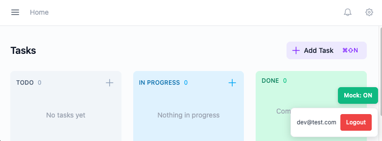

# PraxisNote

[](https://github.com/garethbaumgart/praxis-note/actions/workflows/deploy-cloud-run.yml)


A task management system with a kanban board. Currently features drag-and-drop task management with three-state workflow (Todo → In Progress → Done).

**Live:** https://praxisnote-kv77ni5hzq-ts.a.run.app

## Overview

PraxisNote is evolving into a note-first task management system. The vision: write naturally in rich text notes, and any checkbox you create automatically becomes a trackable task on your board with bidirectional sync.

### Key Features

- ✅ **Three-State Tasks** - Todo → In Progress → Done lifecycle with timestamps
- ✅ **Kanban Board** - Drag-and-drop task management with inline creation
- ✅ **Due Dates** - Set due dates with visual urgency indicators (overdue, today, tomorrow, this week)
- ✅ **Task Comments** - Add comments to tasks with click-to-edit
- ✅ **Google OAuth** - Secure authentication with user accounts
- 🚧 **Note-First Workflow** - Capture thoughts in rich text notes
- 🚧 **Automatic Task Extraction** - Checkboxes in notes become tasks on your board
- 🚧 **Bidirectional Sync** - Complete a task on the board, and the checkbox in your note is checked (and vice versa)
- 🚧 **Label Organization** - Tag notes and tasks; tasks inherit labels from their source note

✅ = Implemented | 🚧 = Planned

## Architecture

See [Architecture Decision Records](docs/adr/) for documented decisions on patterns and technology choices.

## Tech Stack

- .NET 10, C# (nullable reference types, implicit usings)
- Angular 21 with PrimeNG and Tailwind CSS
- EF Core with PostgreSQL
- xUnit for testing
- DDD (Domain-Driven Design)

## Project Structure

```
src/
├── PraxisNote.Domain/           # Pure domain model (no dependencies)
│   ├── Aggregates/              # User, Label, TaskItem, Note
│   ├── ValueObjects/            # Email, TaskStatus, DueDate, etc.
│   ├── Common/                  # Entity, AggregateRoot, ValueObject
│   └── Events/                  # Domain events
├── PraxisNote.Application/      # Application layer (use cases)
│   ├── Common/                  # IUnitOfWork, shared interfaces
│   └── Features/                # Use cases by feature
├── PraxisNote.Infrastructure/   # Persistence & external services
│   ├── Persistence/             # EF Core DbContext, repositories
│   └── Migrations/              # EF Core migrations
└── PraxisNote.Web/              # ASP.NET Core + Angular frontend
    ├── Endpoints/               # Minimal API endpoints
    └── ClientApp/               # Angular 21 SPA

tests/
├── PraxisNote.Domain.Tests/     # Domain unit tests (xUnit)
└── PraxisNote.E2E.Tests/        # Playwright E2E tests
    ├── smoke-tests/             # Auth and health tests
    └── helpers/                 # DB reset utilities
```

## Getting Started

### Prerequisites

- .NET 10 SDK
- Node.js 22+
- Docker (for PostgreSQL)

### Build and Test

```bash
dotnet build src/PraxisNote.slnx
dotnet test tests/PraxisNote.Domain.Tests
```

### Running Locally (Recommended)

The easiest way to run the full stack locally with hot reload. No secrets or configuration required.

From the project root:

```bash
docker compose --profile dev-stack up
```

This starts:
- **PostgreSQL** on port 5432
- **.NET API** on port 5002 (with hot reload via `dotnet watch`)
- **Angular** on port 4200 (with hot reload)

Open http://localhost:4200 and start developing. Changes to both frontend and backend code will automatically reload.

**Note:** The dev environment uses mock authentication - no Google OAuth setup required. Use the mock auth toolbar at the bottom of the screen to log in.

To stop:
```bash
docker compose --profile dev-stack down
```

### Running Locally (Manual)

If you prefer to run services individually:

1. Start PostgreSQL:
   ```bash
   docker compose --profile dev up -d
   ```

2. Configure secrets (see Database and Authentication sections below)

3. Run the .NET backend:
   ```bash
   cd src/PraxisNote.Web
   dotnet watch run
   ```

4. In a separate terminal, run the Angular frontend:
   ```bash
   cd src/PraxisNote.Web/ClientApp
   npm install
   npm start
   ```

## Database Setup

PraxisNote uses PostgreSQL. The connection string must be configured via user secrets (not stored in source control).

### Configure Connection String

```bash
cd src/PraxisNote.Web

# Set the PostgreSQL connection string
dotnet user-secrets set "ConnectionStrings:DefaultConnection" "Host=localhost;Port=5432;Database=praxisnote;Username=praxisnote;Password=devTestPassword"
```

The `docker-compose.yml` creates a PostgreSQL container with these default credentials. Migrations run automatically on startup in Development mode.

## Authentication Setup

> **Note:** For local development, you can skip this section entirely and use the **Mock Authentication** toolbar instead (see Development Tools below). Only set up Google OAuth if you specifically need to test the production auth flow.

PraxisNote uses Google OAuth for authentication. Secrets are stored using .NET User Secrets to keep them out of source control.

### 1. Create Google OAuth Credentials

1. Go to [Google Cloud Console](https://console.cloud.google.com/)
2. Create a new project (or select an existing one)
3. Navigate to **APIs & Services > Credentials**
4. Click **Create Credentials > OAuth client ID**
5. Select **Web application**
6. Add authorized redirect URI: `http://localhost:5002/signin-google`
   - Note: `/signin-google` is the default callback path used by ASP.NET Core's Google authentication middleware
7. Copy the Client ID and Client Secret

### 2. Configure User Secrets

User Secrets stores credentials outside your project directory at `~/.microsoft/usersecrets/`.

```bash
cd src/PraxisNote.Web

# Set your Google OAuth credentials
dotnet user-secrets set "Authentication:Google:ClientId" "YOUR_CLIENT_ID.apps.googleusercontent.com"
dotnet user-secrets set "Authentication:Google:ClientSecret" "YOUR_CLIENT_SECRET"

# Verify secrets are stored
dotnet user-secrets list
```

### 3. Managing Secrets

```bash
# View all secrets
dotnet user-secrets list

# Remove a specific secret
dotnet user-secrets remove "Authentication:Google:ClientId"

# Clear all secrets
dotnet user-secrets clear
```

## Development Tools

### Mock Authentication

For local development and E2E testing, PraxisNote includes a mock authentication system that bypasses Google OAuth.



**How it works:**
- A dev toolbar appears in the bottom-right corner in Development/E2E environments
- Toggle "Mock: ON" to enable, enter any email and click "Login"
- The Angular app sends an `X-Mock-User` header with API requests
- The backend `MockAuthenticationHandler` processes this header and creates/authenticates users
- Mock auth is completely disabled in Production builds

**When to use:**
- Local development without Google OAuth credentials
- E2E tests that need authenticated API access
- Testing user-specific features quickly

### Keyboard Shortcuts

| Key | Action |
|-----|--------|
| `N` | Create new task in Todo column (inline) |
| `Enter` | Submit task |
| `Escape` | Cancel task creation |
| `Shift+Enter` | Add newline when editing task title |

## E2E Tests

End-to-end tests use Playwright with a separate PostgreSQL instance (port 5433).

```bash
# Run E2E tests (starts its own database container)
cd tests/PraxisNote.E2E.Tests
npm install
npm test
```

E2E tests use the mock authentication system via the `X-Mock-User` header to authenticate API requests without requiring Google OAuth.

## CI/CD Pipeline

GitHub Actions runs automatically on every push to `main` and on pull requests:

| Workflow | Trigger | What it does |
|----------|---------|--------------|
| **Unit Tests** | Push/PR | Runs `dotnet test` on Domain tests |
| **E2E Tests** | Push/PR | Spins up PostgreSQL, runs migrations, starts the app, runs Playwright tests |
| **Copilot Review** | PR only | AI-powered code review with suggestions |
| **CodeRabbit Review** | PR only | AI-powered code review with detailed line-by-line feedback |

### E2E Test Pipeline Details

The E2E workflow:
1. Starts a PostgreSQL service container (port 5433)
2. Applies EF Core migrations to create the schema
3. Builds and starts the .NET application in E2E mode
4. Runs Playwright smoke tests (auth, health, tasks, API access)
5. Uploads HTML test reports as artifacts on failure

PRs require all tests to pass before merge.

## Troubleshooting

### NuGet Authentication Errors

If you see errors like `401 Unauthorized` from Azure DevOps or other private feeds:

```
error NU1301: Unable to load the service index for source https://pkgs.dev.azure.com/...
```

This happens when your global `~/.nuget/NuGet/NuGet.Config` contains private feeds. The project includes a `nuget.config` that clears inherited sources, but if issues persist:

```bash
# Verify the project config is being used
dotnet restore --verbosity detailed | head -20

# Force restore with only nuget.org
dotnet restore --source https://api.nuget.org/v3/index.json
```

### E2E Tests Fail to Start

If E2E tests fail with database connection errors:

1. Ensure Docker is running
2. Check no other service is using port 5433:
   ```bash
   lsof -i :5433
   ```
3. Clean up orphan containers:
   ```bash
   docker compose --profile e2e down --remove-orphans
   ```

### EF Tools Version Warning

If you see "Entity Framework tools version is older than runtime":

```bash
dotnet tool update --global dotnet-ef
```

## Production Deployment

Deployed to **Google Cloud Run** (Sydney) + **Neon PostgreSQL** (Sydney).

| Component | Service | Region |
|-----------|---------|--------|
| App | Cloud Run | australia-southeast1 |
| Database | Neon PostgreSQL | ap-southeast-2 |
| Secrets | GCP Secret Manager | - |
| Images | Artifact Registry | australia-southeast1 |

### Auto-Deploy

Push to `main` triggers GitHub Actions workflow:
1. Builds Docker image
2. Pushes to Artifact Registry
3. Deploys to Cloud Run

### Required GitHub Secrets

| Secret | Description |
|--------|-------------|
| `GCP_PROJECT_ID` | GCP project ID |
| `GCP_SERVICE_ACCOUNT` | Service account email |
| `GCP_WORKLOAD_IDENTITY_PROVIDER` | Workload Identity provider path |

### Required GCP Secrets

| Secret | Description |
|--------|-------------|
| `CONNECTION_STRING` | Neon PostgreSQL connection string |
| `GOOGLE_CLIENT_ID` | Google OAuth client ID |
| `GOOGLE_CLIENT_SECRET` | Google OAuth client secret |

### Local Docker Testing

```bash
docker build -t praxisnote .
docker run -p 8080:8080 \
  -e ConnectionStrings__DefaultConnection="Host=host.docker.internal;Port=5432;..." \
  -e Authentication__Google__ClientId="..." \
  -e Authentication__Google__ClientSecret="..." \
  praxisnote
```
